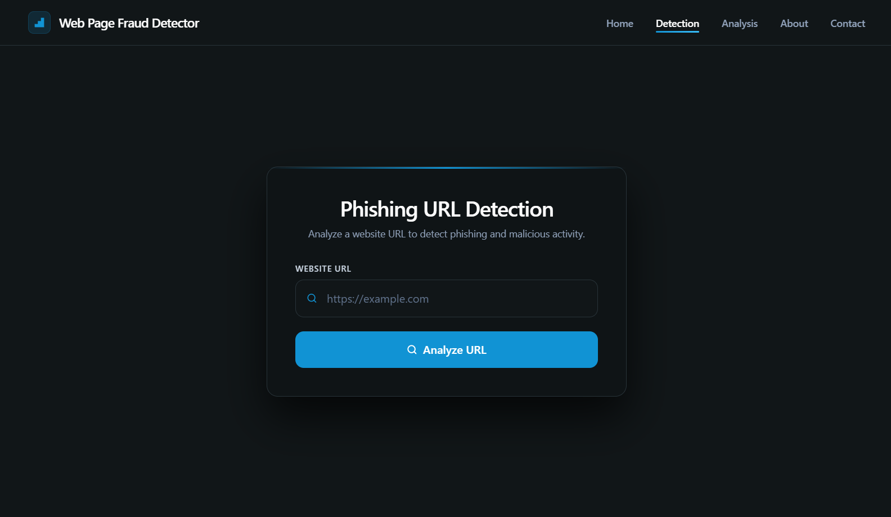
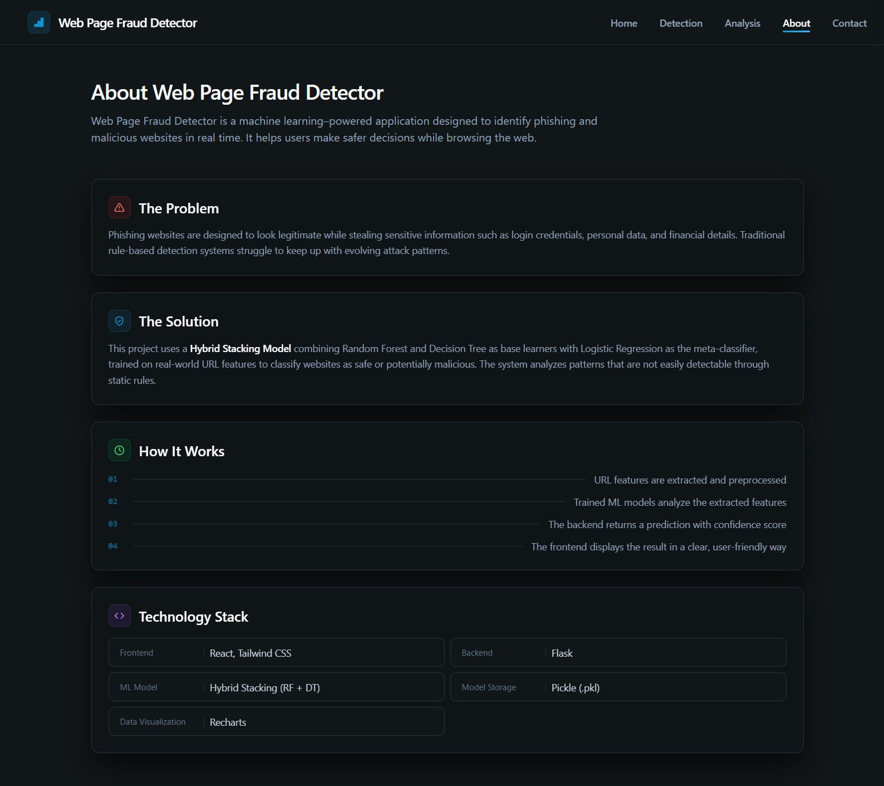
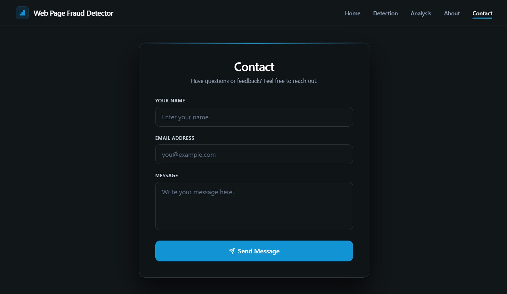

<div align="center">

# 🔐 Precise & Enhanced Webpage Fraud Detection Using Machine Learning

### Hybrid Stacking Ensemble for Real-Time Phishing URL Detection

[](https://python.org)
[](https://flask.palletsprojects.com)
[](https://reactjs.org)
[](https://scikit-learn.org)
[]()

**A hybrid machine learning system for real-time phishing URL detection using ensemble learning, heuristic analysis, and a full-stack web application.**

Bachelor of Engineering Major Project
Department of Computer Science and Engineering (AI & ML)
Alamuri Ratnamala Institute of Engineering and Technology (ARMIET)
University of Mumbai | Academic Year 2025–2026

</div>

---

# 📌 Overview

Phishing attacks and malicious webpages have become one of the most significant cybersecurity threats. Traditional blacklist and rule-based approaches often fail to detect newly emerging attacks.

This project proposes a **Hybrid Stacking Ensemble Model** that combines:

* 🌲 Random Forest
* 🌳 Decision Tree
* 📈 Logistic Regression (Meta Classifier)

to provide highly accurate and reliable phishing URL detection.

The system is deployed as a complete **Flask + React.js** web application that performs real-time URL analysis and returns predictions with confidence scores.

---

# ✨ Key Features

* 🔍 Real-time phishing URL detection
* 🤖 Hybrid Stacking Ensemble model
* 🧹 Heuristic-based filtering layer
* 📊 Analytics dashboard
* 📈 Confidence score prediction
* ⚡ Flask REST API
* 📱 Responsive React frontend
* 🔒 Privacy-compliant URL-only analysis
* 📉 Reduced false positives and false negatives

---

# 🏗 System Architecture

```text
User Input
     ↓
URL Validation
     ↓
Heuristic Filtering
     ↓
Feature Extraction
(111 URL Features)
     ↓
Random Forest + Decision Tree
(Base Learners)
     ↓
Logistic Regression
(Meta Classifier)
     ↓
Prediction + Confidence Score
     ↓
Response Generation
     ↓
Result Display
```

---

# 📂 Dataset

| Property           | Value   |
| ------------------ | ------- |
| Total URLs         | 129,698 |
| Features Extracted | 111     |
| Training Split     | 80%     |
| Test Split         | 20%     |
| Random State       | 42      |

### Feature Categories

* 📝 Lexical Features
* 🌐 Domain Features
* 📁 Directory Features
* 🌍 Network Features
* 🔎 DNS Features

---

# 🧠 Machine Learning Models Evaluated

* Random Forest
* Decision Tree
* XGBoost
* CatBoost
* K-Nearest Neighbors (KNN)
* Hybrid Stacking Ensemble (Proposed Model)

---

# 📊 Performance Results

## 🏆 Proposed Hybrid Stacking Model

| Metric    | Score      |
| --------- | ---------- |
| Accuracy  | **99.00%** |
| Precision | **98.69%** |
| Recall    | **98.85%** |
| F1-Score  | **98.77%** |

---

# 📈 Model Comparison

| Model                        | Accuracy   |
| ---------------------------- | ---------- |
| 🏆 Hybrid Stacking (RF + DT) | **99.00%** |
| 🌲 Random Forest             | 98.97%     |
| 🌳 Decision Tree             | 98.22%     |
| ⚡ XGBoost                    | 96.67%     |
| 🐱 CatBoost                  | 95.15%     |
| 📍 KNN                       | 94.49%     |

---

# 📷 Application Screenshots

## 🏠 Home Page


---

## 🔍 Detection Page



---

## 📊 Analytics Dashboard


---

## ℹ️ About Page



---

## 📬 Contact Page



---

# 📈 Performance Analysis

## Accuracy Comparison


---

## Precision Comparison


---

## Recall Comparison


---

## F1 Score Comparison


---

# 🛠 Technology Stack

## Frontend

* React.js
* Tailwind CSS
* Recharts
* Vite

## Backend

* Python
* Flask

## Machine Learning

* Scikit-Learn
* Pandas
* NumPy
* Matplotlib
* Seaborn

## Model Storage

* Pickle

---

# 📁 Project Structure

```text
URL_webpage/
│
├── backend/
│   ├── app1.py
│   ├── feature1.py
│   ├── requirements.txt
│   └── pickle/
│       └── hybrid_stacking_model.pkl
│
├── frontend/
│   ├── src/
│   ├── public/
│   ├── package.json
│   └── vite.config.js
│
├── screenshots/
│   ├── home.png
│   ├── detection.png
│   ├── analytics.png
│   ├── about.png
│   └── contact.png
│
├── images/
│   ├── accuracy.png
│   ├── precision.png
│   ├── recall.png
│   └── f1score.png
│
└── README.md
```

---

# ⚙ Installation

## Clone Repository

```bash
git clone https://github.com/Shubham302004/Precise-And-Enhanced-Webpage-Fraud-Detection-Using-Machine-Learning.git
```

---

## Backend Setup

```bash
cd backend

pip install -r requirements.txt

python app1.py
```

Flask server runs at:

```text
http://127.0.0.1:5000
```

---

## Frontend Setup

```bash
cd frontend

npm install

npm run dev
```

React application runs at:

```text
http://localhost:5173
```

---

# 🚀 Workflow

```text
Step 1 → User enters URL
Step 2 → URL validation
Step 3 → Heuristic analysis
Step 4 → Feature extraction
Step 5 → Hybrid Stacking Model prediction
Step 6 → Confidence score generation
Step 7 → Result displayed to user
```

---

# 🎯 Applications

* Browser Security
* Email Filtering
* Anti-Phishing Solutions
* Enterprise Security
* Cybersecurity Platforms
* Threat Detection Systems

---

# 🔮 Future Enhancements

* Deep Learning Models (CNN, LSTM)
* Browser Extension
* Cloud Deployment
* Explainable AI (SHAP, LIME)
* Real-Time Threat Intelligence
* Multi-language Phishing Detection
* Admin Monitoring Dashboard

---

# 📚 References

1. Comparative Analysis of ML Algorithms for Phishing Website Detection (2024)
2. A Machine Learning Algorithms for Detecting Phishing Websites (2024)
3. Viable Detection of URL Phishing Using Machine Learning Approach (2023)
4. Comparative Study of ML Algorithms for Phishing Website Detection (2023)

---

# 👨‍💻 Authors

* **Shubham Ghodekar**
---

# 📜 License

This project is developed for **educational and research purposes only**.

---

<div align="center">

### ⭐ If you found this project useful, consider giving it a star!

</div>
